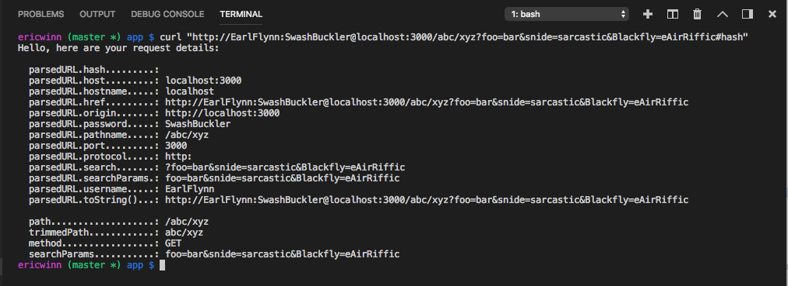

# nodeMonitorURL
RESTful API for an uptime monitoring application for NMC course

## Functional Description

1. The API listens on a PORT and accepts incoming HTTP requests for POST, GET, PUT, DELETE, and HEAD
2. The API allows a client to connect, then create a new user, edit, or delete that user.
3. The API allows a user to "sign in" which gives them a token that they can use for subsequent authenticated requests.
4. The API allows the user to "sign out" which invalidates their token.
5. The API allows a signed-in user to use their token to create a new "check".
   - A task to check a given URL to see if it is up or down.
   - Allow the user to define what "up" or "down" is.
     - *example:* Up == 200 status code
     - *example:* Up == anything that isn't a 500 status code
6. The API allows a signed-in user to edit or delete any of their checks and we want to limit their checks to 5.
7. In the background, workers perform all the "checks" at the appropriate times, and send alerts to the users when a check changes its state from "up" to "down", or vice versa.
   - Checks should run once a minute
   - Send SMS on detected state change, e.g. up to down or down to up when compared to the prior check. If no change, do nothing.

## VS Code NodeJS Debugging Terminal Output
